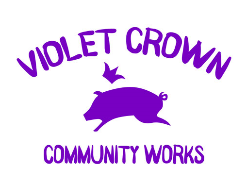

# About Violet Crown Community Works

Violet Crown Community Works is a 501(c)(3) nonprofit organization based in
Austin, Texas, helping build and sustain community in
[Brentwood](http://brentwoodaustin.blogspot.com/) and
[Crestview](http://www.crestviewna.com/) and the surrounding neighborhoods
by supporting neighborhood enhancement projects.

For more information about VCCW, contact Nancy Barnard, President,
[president@violetcrowncommunity.org](mailto:president@violetcrowncommunity.org).  You can send up physical mail at

Violet Crown Community Works 
PO Box 66461 
Austin, TX 78766

## Ways to Donate

You can donate through the PayPal Giving Fund:

You can also help as a sponsor for one of our festivals or Oktoberfests.  See the event pages for more information.

If you want to donate using a donor-advised fund or other mechanism, our Employer Identification Number (EIN) is 45-0509342.

## Sponsored Projects

In addition to the annual Violet Crown Festival in May and the Violet Crown
Oktoberfest, VCCW also has sponsored art projects in the community.  These include:

* [The Wall of Welcome](wall.html), the mural in front of the Minimax grocery store
* [Voices of the Violet Crown](voices.html), stories of neighbors creating community—past, present, and future
* [Friends of Brentwood Park](http://friendsofbrentwoodpark.org/)

## Board Members

* Nancy Barnard (President)
* Ben Combee (Treasurer & Webmaster)
* Bradley Linscomb (Secretary & Past President)
* Lori Gieger
* Sue Minear
* Mike McChesney
* Kristine Poland
* Rob Hill
* David Ezrailson
* Ryan Gordon Katz
* Greg Will

### Previous Festivals

* Violet Crown Festival (1st Saturday in May): [2013](vcf_2013.html), [2014](vcf_2014.html), [2015](vcf_2015.html), [2016](vcf_2016.html), [2017](vcf_2017.html), [2018](vcf_2018.html), [2019](vcf_2019.html), [2020](vcf_2020.html)
* Violet Crown Arts Festival (1st weekend in December): [2013](artsfest_2013.html), [2014](artsfest_2014.html), [2015](artsfest_2015.html),  [2016](artsfest_2016.html)
