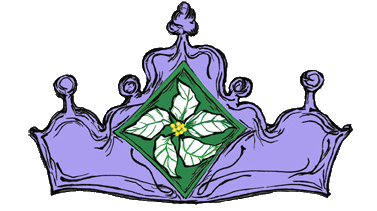
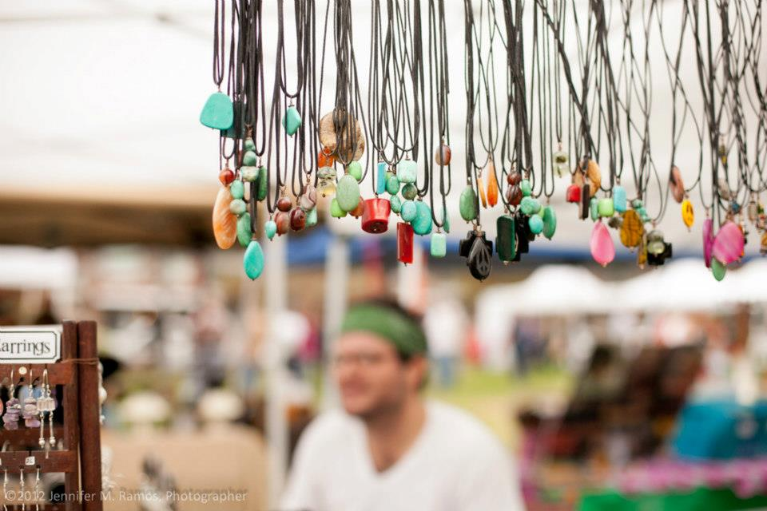

	

		

			<h1>Violet Crown Arts Festival</h1>
			<h2>
				Saturday and Sunday, 
				December 7th-8th, 2013, 
				10AM to 5PM,
				<a href="https://plus.google.com/100912139126813023202/about?gl=us&amp;hl=en">Triangle Park (map)</a>
			</h2>
		

		

	

### Artist Application now Open until October 31st

### Details

Bring the family, friends & neighbors, pack a blanket and some lawn chairs,
and plan to spend the day. Enjoy great quality art from unique local artists,
and live entertainment from all around Austin. The location at the Triangle
Park provides plenty of parking. Admission is free.

### About

Festival attendees can expect to find unique artwork from talented sculptors,
potters, and fiber artists, painters, jewelers, glass artists, woodworkers and
metal smiths. Live music will be featured on the covered stage with
entertainers from all around town performing including a special appearance by
lively marching bands.

Triangle Park is an ideal venue for the festival, it is literally on the
boundary of the Violet Crown Community Works neighborhoods. Centrally located
on 46th Street between North Lamar and West Guadalupe, there is plenty of free
parking.