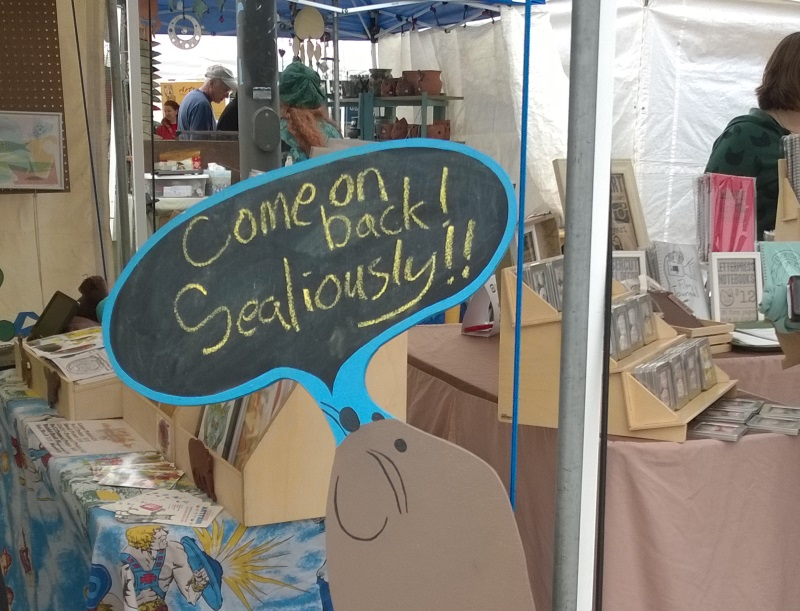

	

		

		

			<h1>2015 Violet Crown Arts Festival</h1>
			<h2>
				Saturday, December 5th 
				Sunday, December 6th 
				10AM to 5PM 
				 
				<a href="https://goo.gl/maps/xov1S">Brentwood Elementary School</a>
			</h2>
		

	

	

  

	

		

			<h3>The Festival</h3>

			
Brentwood Elementary School, a Creative Learning Classroom Initiative, has
			embraced the Violet Crown Arts Festival and will host it in the heart of the
			Brentwood &amp; Crestview neighborhoods that the VCCW supports. The festival
			will be held in the school’s west parking lot at
			<a href="https://goo.gl/maps/xov1S">6700 Yates, Austin, TX 78757</a>.

			
Expect to find unique artwork from talented sculptors, potters, and fiber
			artists, painters, jewelers, glass artists, woodworkers and metal smiths. Shop
			for hand made gifts and great quality art, and support local cottage
			businesses.  It's always free admission for the whole family!

		

	

	

		<h3>RSVP on Facebook</h3>

		
We've created <a href="https://www.facebook.com/events/1569339103384040/">a
		Facebook event for the Violet Crown Arts Festival</a> if you want to stay
		informed as we provide updates on location, artists, and music.

	

	

		

        

	

		<h3>Getting There</h3>

		
The festival will be in the parking lot on the west side of the school.  Some
		parking is available in the neighborhood, but we encourage you to walk, bike,
		or take Capitol Metro bus service.  Bus lines 3, 5, 320, and 803 are all within
		a fifteen minute walk of the school.

	

	

		<h3>Music</h3>

		
Saturday

		<ul>
		<li>10:00 - 11:30   CarpeSono - a cappella performers</li>
		<li>12:00 -   1:00   Glowing Strands - original music &amp; covers</li>
		<li>1:00 -   3:00   Shaidri & Ezra -  original music blues &amp; jazz</li>
		<li>3:00 -   5:00   Paul Klemperer - PK sax w/ Mitch Watkins &amp; Sarah Sharp</li>
		</ul>
		
Sunday

		<ul>
		<li>10:00 - 11:00   Voices of Light  -  a cappella choir 20 voices strong</li>
		<li>11:30 -   1:00   The Light Upstairs  ~  original music firmly rooted in folk</li>
		<li>1:30 -   3:00   Kathy & The Kilowatts  ~  original music rhythm &amp; blues</li>
		<li>3:00 -   5:00   Diana Cantu Band  ~  original tunes &amp; rocking us out</li>
		</ul>

	

	

		<h3>Food</h3>

		<ul>
		<li><a href="https://www.facebook.com/Jack-Hates-Coffee-133957846684052/">Jack Hates Coffee</a></li>
		<li><a href="https://www.facebook.com/empanada.mia.austin">Empanada Mia</a></li>
		</ul>

	

	

		<h3>Artists</h3>

<ul>
<li><a href="http://3doggsdesigns.etsy.com">3 Doggs Design</a></li>
<li><a href="http://www.adapt.org">ADAPT</a></li>
<li><a href="http://www.archeomoderndesigns.com">ArcheoModern Designs</a></li>
<li><a href="http://www.bylillian.com">by Lillian</a></li>
<li><a href="http://www.facebook.com/catscustomstiedye">Cat's Customs: Contemporary Tie Dye</a></li>
<li><a href="http://gems23rd.blogspot.com">Elementals</a></li>
<li><a href="http://www.flamelessshirt.com">Flameless Shirts</a></li>
<li><a href="http://www.facebook.com/gardengizmos.org">Garden Gizmos</a></li>
<li><a href="http://www.grannygoodfish.com">Granny Good Fish</a></li>
<li><a href="http://www.jimbobsalazar.blogspot.com">Green Dog Studio</a></li>
<li><a href="http://www.etsy.com/shop/ladyalchemy13">LadyAlchemy 13</a></li>
<li><a href="http://www.masterpiecesbymichiel.com">Master Pieces By Michiel</a></li>
<li>Maya Weaver</li>
<li>Medieval Rune Casting</li>
<li>Monkey Volt</li>
<li><a href="http://www.etsy.com/shop/muggsclaystudio">Muggs Clay Studio</a></li>
<li><a href="http://www.naturalmagickshop.com">Natural Magick Shop</a></li>
<li><a href="http://natureskeybotanicals.etsy.com">Nature's Key Botanicals</a></li>
<li>Portable Soul Studio</li>
<li><a href="http://radiances.vpweb.com">Radiances</a></li>
<li><a href="https://www.etsy.com/shop/sksurfgirl">Sew Kors</a></li>
<li><a href="http://www.sporecloud.com">Sporecloud</a></li>
<li><a href="http://www.stonesthrowstudio.com">Stones Throw Studio</a></li>
<li><a href="http://www.techlectic.com">techlectic</a></li>
<li><a href="http://www.terrisglasscreations.com">Terri's Glass Creations</a></li>
<li><a href="http://thirdcoastartglass.blog.com">Third Coast Art Glass</a></li>
<li><a href="http://willowtreeworks.wordpress.com">Willow Tree Works</a></li>
<li><a href="https://www.facebook.com/joytothewreath/">Joy to the Wreath</a></li>
<li><a href="https://squareup.com/market/bycarianne">by Carianne</a></li>
<li><a href="http://www.athenasilversmith.com/">Athena Silversmith</a></li>
</ul>

<ul>
<li><a href="http://www.cdqart.com/">CDQ Art</a></li>
<li>Sassywrappings</li>
<li>Elisabeth Flohr Jewelry</li>
<li><a href="https://www.etsy.com/shop/wickhabit/">Wick Habit</a></li>
<li>Glenn Corser</li>
<li>Inna Davi</li>
<li><a href="http://www.benjaminsoap.com">Benjamin Soap Co.</a></li>
<li><a href="http://jimbobsalazar.blogspot.com/">Green Dog Studio</a></li>
<li><a href="https://www.etsy.com/shop/BuddhaHill">Buddha Hill</a></li>
<li><a href="http://www.devonshireorganics.com/">Dovenshire Incense &amp; Soap Co.</a></li>
<li><a href="http://www.myurbanponcho.com/">My Urban Poncho</a></li>
<li><a href="http://daltondesignsonline.com/">Dalton Designs</a></li>
<li><a href="http://www.sticklizarddesigns.com/">Stick Lizard Designs</a></li>
<li><a href="http://www.sweetsparrowstudio.com/">Sweet Sparrow Studio</a></li>
<li><a href="http://ownalisa.com">ownalisa</a></li>
<li><a href="http://www.salvationcentral.com/">Salvation Central</a></li>
<li><a href="https://www.facebook.com/Beecuriouscandlesandcrafts">Bee Curious Candles &amp; Crafts</a></li>
<li><a href="https://squareup.com/market/hallmark-potteryok">Hallmark Pottery</a></li>
<li><a href="https://nikkidowd.wordpress.com/">Nikki Dowd Art</a></li>
<li><a href="http://www.phishross.com/">Primordial Persuasions</a></li>
<li><a href="http://hellonwheelsjewelry.com/">Hell On Wheels Jewelry</a></li>
<li>odderpotter</li>
<li><a href="http://www.yellowelephantclothing.com/">Yellow Elephant Clothing</a></li>
<li>Small Strangers</li>
<li><a href="http://www.wildnaturethemejewelry.com/">Wild Nature Theme Jewelry</a></li>
<li><a href="http://www.nwf.org/">National Wildlife Federation</a></li>
</ul>

	

		<h3>Contact</h3>

		
For questions about the festival, please mail <a href="mailto:violetcrownartsfestival@gmail.com">violetcrownartsfestival@gmail.com</a>.

		
If you wish to exhibit at the festival, please
		<a href="artsfest_apply.html">visit our festival guidelines and
		application page</a>.  Artist applications will open at the beginning of September.

	

