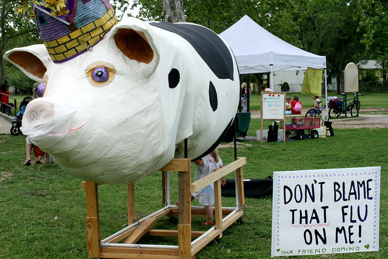

The Story of Domino, the Violet Crown Pig
=========================================

By Shayla Fleshman, 2004

May, 17, 2003. The day of the first Violet Crown Festival had arrived. After
months of intensive planning, we were finally on the day of the event. It’s
not easy trying new things. Several times, the festival had seemed doomed for
disaster as we struggled to get needed permits, funding, volunteers and
neighborhood support for a new idea. Details, details, so many details. But
here we were all working together on a beautiful sunny day setting things up,
nervously hoping folks would show. 

This first hint that something had gone astray was in the sound check on the
music stage. “Testing, one-two-three. Testing, one-two-three … hey, there’s a
pig running, there’s a pig running loose,” said John Fremgen into the
microphone. He had a bird’s eye view of what was about to happen. Apparently,
a baby pig had jumped out from the petting zoo as fast as his little legs
could carry him. Across the festival grounds volunteers stopped what they
were doing and gave chase. It was a site to behold . . . people running,
diving, lunging after this small pig who was too fast for all of us.

Turning our event topsy-turvy, it then shot across the open park and
disappeared into the neighborhood. But that small pig had accomplished its
mission of making folks stop what they were doing for a moment and laugh,
thus lightening the mood that would carry us throughout the day. It was a
success!

Afterwards, life slowly returned to normal, but with one difference.
Throughout the summer, pig sightings started cropping up. The new owner of
the Crestview Barber Shop, Pam Jacks, saw it running down the street one
morning on her way to work. Jeff Dickey [who coordinated festival art booths
from 2003 to 2005] watched Animal Control chase it, hoping that they could
actually catch this fast creature on foot with a noose.

Teresa Edwards [who ran children’s activities at the festival in 2004] clearly
remembered her encounter with the pig. About a month after the festival, she
was walking her new dog down the street at dusk and the dog went into a
frenzy. There in the twilight was a pig standing at the end of the street but
it rounded the corner and disappeared. “The pig then reappears, dashes past
us and behind it is this tall lanky cowboy, boots on pavements, elbows up,
running after this pig. It looked like a Texas “Keystone Cops,” she
said. “Then this lady in an SUV who lives down the street drove up looking
for both the cowboy and the pig. She worked for the Humane Society and then
recognized my dog since I had gotten it there. It’s a small world.” 

So our neighborhood had a new resident that was wreaking havoc, rooting around
gardens and thriving in its city habitat. Eventually, pig sightings stopped.
Then last September, my husband and I were walking the dogs early one
morning. When we rounded the corner of Woodrow and Arroyo Seco, we heard the
unmistakable sound of grunting coming out of Paulette’s backyard. Yep, there
was a pig wearing a red bandana. But was it the pig?

We knocked on the door. Not many folks know shy Paulette, but most residents
do enjoy her “Sunflower Way.” Every year Paulette creatively grows a
beautiful sunflower garden across the street from Crestview Shopping Center.
Sure enough, she said that the pig had appeared out of nowhere two months
earlier. She, too, had called Animal Control. They came and this time caught
the animal, put it in their truck, and drove off. 

Amazingly, about a week later the pig showed up again in Paulette’s back yard.
This time, she kept it and named it Domino for the spots on its rump.
Sleeping at her feet, she tamed this wild creature as she had tamed a blue
jay that also lived with her. Domino was one smart pig to know to go back to
Paulette’s house, where he would be loved and fed leftovers that she picked
up from the farmers’ market several days a week.

But Domino was no longer a small pig. Domino was actually a feral hog and
getting much bigger on all that good food he was devouring, yet Domino had
become our neighborhood’s “Wilbur.” Folks would stop to look at him and
sometimes feed him. But he was only tame with Paulette.

In early October, I receive a call from Paulette. Her landlord had discovered
Domino and told her, “Either he goes, or you do.” What to do? Well, the
farmer who had sponsored our petting zoo (Mike Jack) was very willing to take
Domino back as a farm animal, which meant Domino would probably be on
someone’s table in the near future. Paulette made me promise to find Domino a
loving home, as he was now a pet. Problem is, most folks don’t keep feral
hogs as pets. The clock was ticking, even though he was on a waiting list for
Kinky Friedman’s Pet Utopia. We had to get Domino out of Paulette’s yard and
there were no options. Mike thought I was a crazy city-girl for even
suggesting that the pig be raised as anything other than what it was. But a
promise is a promise.  

So we worked out a deal. He would come get the animal and leave it in a
trailer in front of my house for several days. If the pig is still in the
trailer when picked up, it was supper. If the trailer was empty, good
riddance. I sent an email to everyone I knew in a panic looking for a home
for Domino. It wasn’t needed. When Mike and his friend David Sherrill met
Paulette and saw the special relationship she had with this pig and how
Domino had defied the odds, it melted this farmer’s heart, and he promised
Paulette that he would throw the pig in with the goats and raise it. She
accepted the offer.

It was a sad parting because Paulette and Domino were very attached to each
other. It also happened on the same day that she learned that her husband had
an advanced case of cancer.  “I feel like I’m losing everything I love in the
world,” she said at the time. Less than two months later, Paulette’s husband
passed away. Paulette, though, has recently found a new love and a new life
in Marble Falls. We will miss her wonderful garden every year. Domino escaped
from the goat pen one morning to return to the very place where his adventure
began. David Sherrill says he keeps an eye out for a feral hog wearing the
red bandana.

That’s why Domino graced our festival t-shirt in 2004. We give tribute to
Domino, the Violet Crown Pig; to Paulette and her beautiful sunflowers; and
to all our neighborhood legends who make this such a wonderful and unique
place to call home.

[Domino also inspired artist Jean Graham’s vision for the Procession of the
Violet Crowns, as part of First Night Austin. More than 100 Brentwood and
Crestview neighbors participated in the event on New Year’s Eve in 2005 and
2009. The ten-foot-long Domino puppet Jean created for First Night still
makes appearances at the Violet Crown Festival and other local events. The
house where Paulette lived was torn down sometime in 2006. For a time you
still could find a few sunflowers blooming around the edges of her
yard. —Susan Burneson]

Domino lives on as the mascot for the Violet Crown Festival and
visits every year for mirth and photos!
