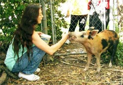

The Tale of Domino the Pig
==========================

May 17, 2003. The day of the very first Violet Crown Festival had arrived. It
was mid-morning, and a team of us were working to get everything ready,
nervously hoping that everyone would show up in just a few hours.

We had the first hint that something had gone astray during the music stage
sound check: “Testing, one-two-three. Testing, one-two-three . . . Hey!
There’s a pig running loose!” yelled John Fremgen into the mike. He had a
bird’s-eye view of what was happening—A baby pig had escaped from the petting
zoo and was running as fast as his little legs could carry him.

Volunteers stopped what they were doing and gave chase. It was a sight to
behold— people running, diving, lunging after this small pig, who made a
beeline across the park and disappeared near Justin and Yates.

After the festival, life returned to normal, but with a difference: Pig
sightings began to crop up. Pam Jacks, owner of the Crestview Barber Shop,
said she saw it running down the street one morning on her way to work. Jeff
Dickey, who coordinated art booths at the festival from 2003-2005, said he saw
Animal Control chase the pig down Arroyo Seco in a futile attempt to catch it.

Teresa Edwards, who coordinated family activities at the festival in 2004, was
walking her newly adopted dog at dusk when the dog went into a frenzy. There
in the twilight, at the end of the street, Teresa saw a pig, but it rounded
the corner and disappeared. “The pig reappeared and dashed past us. Running
behind the pig is this tall lanky cowboy, boots clicking on the pavement. It
looked like a Texas ‘Keystone Cops,’” she said. “ Then a lady who lives down
the street drove up in an SUV looking for the cowboy and the pig. As it turned
out, she worked for the Humane Society and recognized my dog by name. It’s a
small world!”

Our neighborhood had a new, elusive resident that seemed to be thriving in its
urban habitat. Later that summer, pig sightings stopped. Had the pig become an
urban legend, after all?

Then, sometime in September 2003, Shayla and Tom Fleshman were walking their
dogs early one morning. They rounded the northwest corner of Woodrow and
Arroyo Seco and heard the unmistakable sound of grunting in Paulette Fiske’s
backyard. Yep, there was a pig wearing a red bandanna. But was it the pig?
They knocked on the door to find out. Not many people knew shy Paulette, who
created “Sunflower Way,” a beautiful sunflower garden that she grew every
year. Sure enough, the pig had appeared out of nowhere two months earlier.
She, too, had called Animal Control. They caught it, put it in their truck,
and drove off.

A week later the pig showed up again in Paulette’s backyard. This time, she
kept it, named it Domino for the spots on its rump, and tied a red bandanna
around its neck. She tamed this wild creature, actually a feral hog, just as
she had tamed a blue jay that also lived with her. Domino slept at her feet
and jumped into her lap to be petted. Domino was one smart pig to know to go
back to Paulette’s, where he was well loved and well fed.

By now, Domino was getting much bigger on all the good food he was devouring.
Then, in early October, Paulette’s landlord told her, “Either Domino goes, or
you do.” Paulette called Shayla and made her promise to find Domino a loving
home, as he was now a pet. What to do?

We got Domino on a waiting list at Kinky Friedman’s Utopia Animal Rescue Ranch
and asked everyone we knew if they could adopt Domino. Time was running out.
Then, Mike Jack, who coordinated the petting zoo in 2003, and his friend David
Sherrill met Paulette and saw what a special relationship she had with Domino.
They agreed to keep Domino in with the goats and raise him, and Paulette
accepted his offer. It was a sad parting because Paulette and Domino were so
attached to each other. On the same day Domino left Paulette learned that her
husband had cancer. “I feel like I’m losing everything I love in the world,”
she said. Less than two months later, Paulette’s husband passed away.

Paulette, though, found a new love and a new life in Marble Falls. We will
miss her wonderful garden every year. Not long after Paulette moved away,
Domino escaped again, this time from his goat pen. Could he be on his way back
to where his adventure began? David Sherrill says he keeps an eye out for a
feral hog wearing a red bandana.

Domino inspired the design of the festival t-shirt in 2004 and Jean Graham’s
vision for the Procession of the Violet Crowns, as part of First Night Austin.
More than 100 Brentwood and Crestview neighbors participated in the event on
New Year’s Eve in 2005 and 2009.

Sometime in 2006, the house where Paulette had lived was torn down, but you
still can find a few sunflowers blooming around the edges of her yard.

We pay tribute to Domino, the Violet Crown Pig; to Paulette Fiske and her
beautiful sunflowers; and to all our neighborhood legends who make this such a
unique place to call home.

_&mdash; Shayla Fleshman and Susan Burneson_