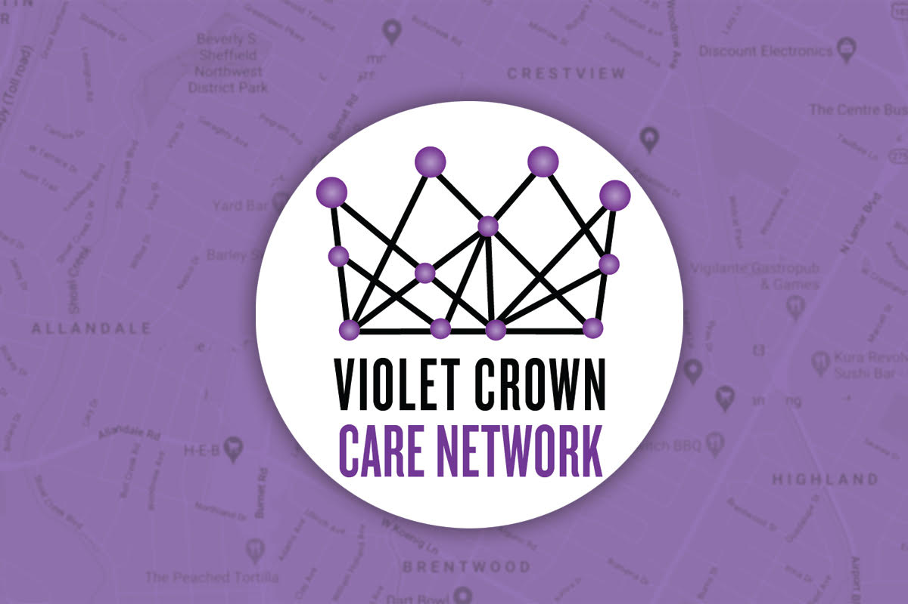

We at Violet Crown Community Works are acting as a fiscal sponsor for a new neighborhood group, the Violet Crown Care Committee.

The Violet Crown Care Network was formed by Crestview, Brentwood, and
Allandale neighborhood leaders to assist neighbors during the COVID-19
pandemic. They are working hard to provide aid to our community by helping
friends and neighbors with grocery shopping, medical care, or other essentials
people may need. 
 
### How to Contact

There are a lot of ways to reach out to them. Whether you need support or want
to help out, they want to get in contact with you. 
 
* [FACEBOOK PAGE](https://www.facebook.com/vccnetwork/)
* [EMAIL](mailto:violetcrowncare@gmail.com)
* [VOLUNTEER SIGNUP](https://docs.google.com/forms/d/e/1FAIpQLSc8GbpIWmlVHxkWkKOcXkMb55urYt1Tr7aQkwssprV4HlYyeA/viewform)

### Donations

If you are in a position to help via a financial contribution, we are taking donations specifically 
to support the Violet Crown Care Committee. Money raised here will go to
help people in the local neighborhoods directly affected by this pandemic, including

1. Purchasing HEB gift cards to donated to neighbors who have been affected
   financially by COVID19
2. Purchasing gift cards from local restaurants providing take out and
   delivery, and donating them to to healthcare workers at hospitals.

Donations are through our 501(c)(3) non-profit and are tax-deductable. You'll
get a tax receipt from the PayPal Giving Fund after submitting, and you'll
have all of our thanks.

