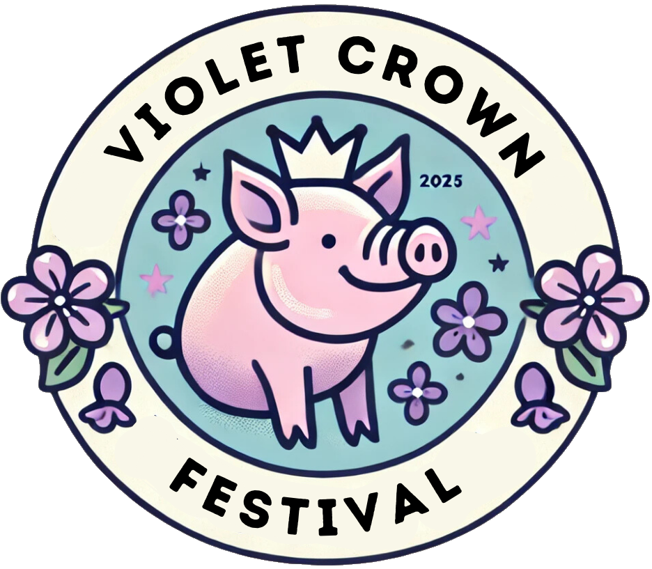
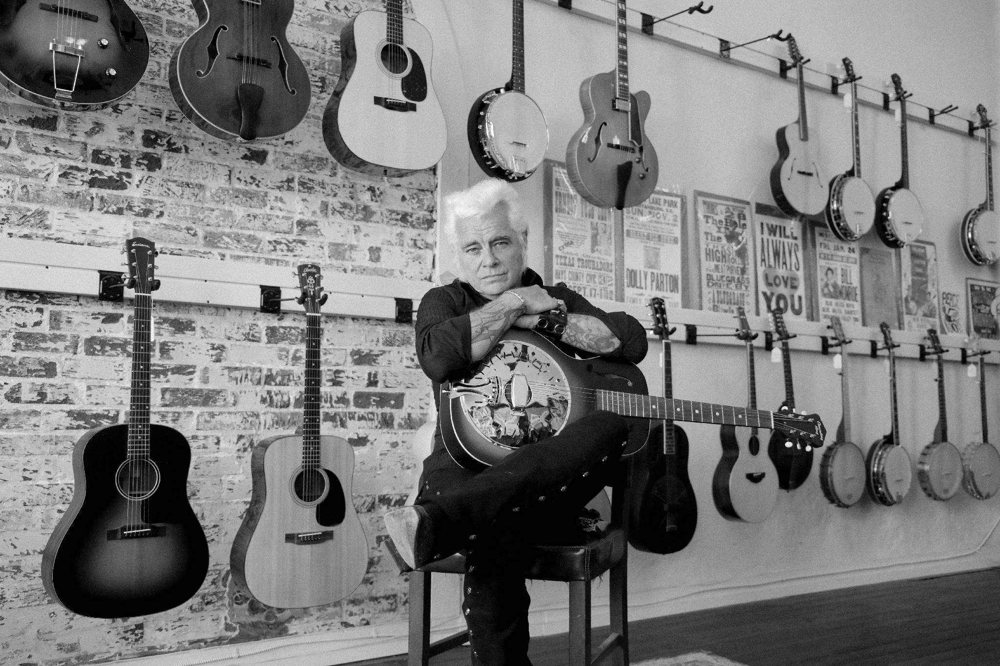

## Violet Crown Festival on CBS Austin

VCF organizer David Ezrailson and volunteer chair Janice Samuelson
were on CBS Austin on Tuesday morning to preview the festival.
You can read the store and see their interview at

[We Are Austin: Violet Crown Festival promises fun for the whole family Saturday](https://cbsaustin.com/features/we-are-austin/violet-crown-festival-promises-fun-for-the-whole-family)

## Our 2025 VCF Headliner: Dale Watson and His Lone Stars

We're pleased as punch to announce that playing our headline
spot at 2pm during the Violet Crown Festival is the one-and-only
[Dale Watson and His Lone Stars](https://dalewatson.com/).

For more music announcements, see [the event page](vcf_2025).

## Tickets for the BBQ Showdown are now available

We have opened up online sales of tickets that grant you the right and
obligation to sample the various briskets prepared by the hard-working
crews in the Violet Crown BBQ Showdown!

[They're available online ahead of the event for $15 a person.](https://square.link/u/VyvrDgfW)
Slots are limited, so pre-order today.

## We're still looking for volunteers

If you'd like to help as a volunteer on the day of the festival,
please see <a href="https://www.signupgenius.com/go/20F0A4AA5A829ABFA7-55767989-event">the festival's
SignUpGenius form for open positions</a>.

## Violet Crown Festival is Back!

After a COVID-hiatus, we've regrouped and will be holding the
[Violet Crown Festival](vcf_2025) again in 2025 on the first
Saturday of May, the 3rd.

This year we are going to do something new and exciting, an amateur BBQ brisket
cook-off contest called the Violet Crown Barbecue Showdown.  If you are
interested in competing, please [fill out our BBQ Showdown interest form](bbq).

You can get the latest updates on the
<a href="https://www.facebook.com/VioletCrownCommunityWorks">Violet Crown Community Works Facebook page</a>.

