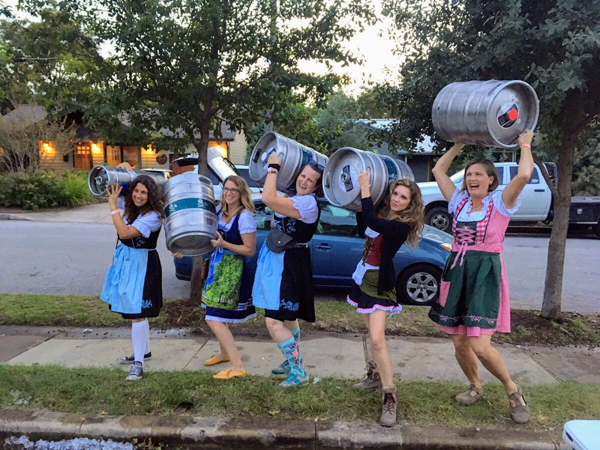

### Oktoberfest 2022

Get that lederhosen and dirndl ready!  The 5th Annual Violet Crown Oktoberfest is coming back to
beautiful Brentwood Park on Saturday, November 5th from 1-5 pm. 

Enjoy free beer from tons of local craft breweries, free sausage dogs,  live music,
food trucks on site, and a big community picnic with your neighbors in our shady beer
garden.  Visit our event page for more details: https://www.facebook.com/events/1250146925719734

This beloved neighborhood party is a true community effort!  Consider pitching in
with short (and beery, um, very fun) volunteer shift!

Sign-up here: https://www.signupgenius.com/go/20f0448aaa92ba3fd0-oktoberfest

Limited edition commemorative cups and steins will be available for purchase at the event as well as the
week before at Dia’s Market and online - stay tuned for details!

The proceeds from this event will benefit Violet Crown Community Works hyperlocal philanthropic
endeavors, including the organization’s new Microgrant Program. The program’s first round of recipients
will be announced at this year’s festival!  Are you part of or familiar with a not-for-profit organization
that could do something meaningful with a grant of $500-1000? Apply here: https://bit.ly/3CY4UaH

We are so grateful to our sponsors! Would your local business be interested in a festival
sponsorship? Email annecharlottep@gmail.com to learn more and receive a sponsorship packet.

### Violet Crown Care Network

We at Violet Crown Community Works are acting as a fiscal sponsor for a new neighborhood group, the Violet Crown Care Committee.

The Violet Crown Care Network was formed by Crestview, Brentwood, and
Allandale neighborhood leaders to assist neighbors during the COVID-19
pandemic. They are working hard to provide aid to our community by helping
friends and neighbors with grocery shopping, medical care, or other essentials
people may need. 
 
### How to Contact

There are a lot of ways to reach out to them. Whether you need support or want
to help out, they want to get in contact with you. 
 
* [FACEBOOK PAGE](https://www.facebook.com/vccnetwork/)
* [EMAIL](mailto:violetcrowncare@gmail.com)
* [VOLUNTEER SIGNUP](https://docs.google.com/forms/d/e/1FAIpQLSc8GbpIWmlVHxkWkKOcXkMb55urYt1Tr7aQkwssprV4HlYyeA/viewform)

### Donations

If you are in a position to help via a financial contribution, we are taking donations specifically 
to support the Violet Crown Care Committee. Money raised here will go to
help people in the local neighborhoods directly affected by this pandemic, including

1. Purchasing HEB gift cards to donated to neighbors who have been affected
   financially by COVID19
2. Purchasing gift cards from local restaurants providing take out and
   delivery, and donating them to to healthcare workers at hospitals.

Donations are through our 501(c)(3) non-profit and are tax-deductable. You'll
get a tax receipt from the PayPal Giving Fund after submitting, and you'll
have all of our thanks.

