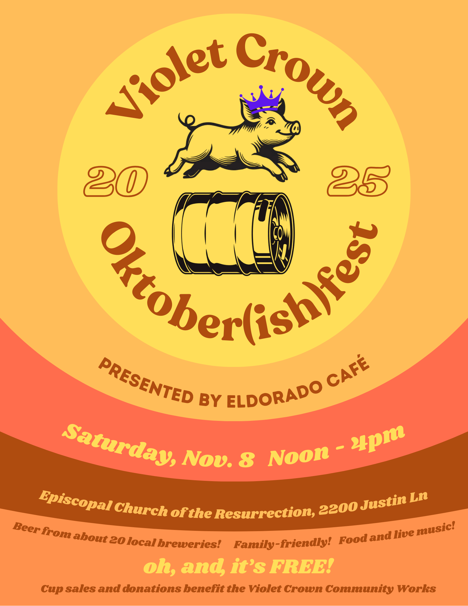
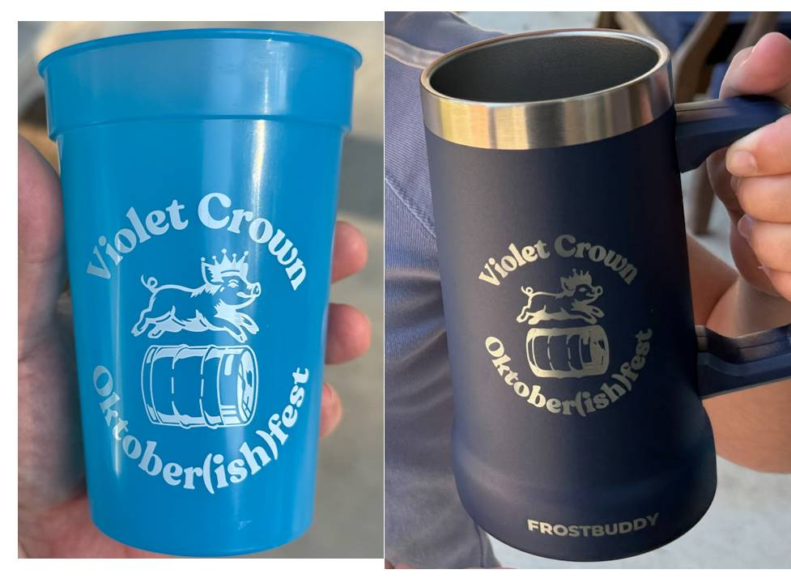

Octoberfest 2025 is coming on Saturday, November 8th, from noon to 4pm.
Presented by our neighborhood friends at <a
href="https://www.eldoradocafeatx.com/">Eldorado Cafe</a>.

The event's once again at the <a
href="https://maps.app.goo.gl/RuLQBc27tvmBmDZt7">Episcopal Church of the
Resurrection at 2200 Justin Ln</a>.  Featuring beer from about 20 local
breweries, along with family-friendly fun, food, and live music.

You can get the latest updates on the <a
href="https://www.facebook.com/VioletCrownOktoberfest">Violet Crown Oktoberfest
Facebook page</a>.  You can also <a
href="https://www.facebook.com/events/772487588722949/">RSVP for the event on
Facebook</a> while you're there.

## Pre-Oktoberfest Cup Sales Are Open

If you want to ensure you get your choice of color-changing cup
or FrostBuddy stein, you can now
<a href="https://square.link/u/bfTwfHS6">pre-buy these from
Violet Crown Community Works</a> to pick up at the festival.

Online sales close about 11PM on Friday night so we can get
the pickup lists ready for the morning.