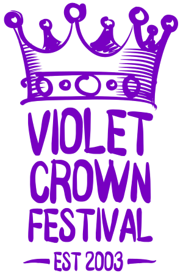

	

		

		

			<h1>Violet Crown Festival</h1>
			<h2>
				Saturday, May 2nd, 2015  
				10AM to 5PM  
				<a href="https://goo.gl/maps/xov1S">Brentwood Elementary School</a>
			</h2>
		

	

### Details

Art, music and more on tap at this year’s festival!

There’s no better way to enjoy a spring Saturday than by spending it at the
Violet Crown Festival. Admission is free.

To get up-to-date information, check the [Violet Crown Festival page on Facebook](https://www.facebook.com/VioletCrownFestival).
We are making frequent updates there with announcements of artists and activities.

### Food Vendors

| VCCW Domino Dogs | hot dogs and sausage wraps, a festival tradition
| [Fire and Slice Pizza](http://www.fireandsliceaustin.com/) | wood-fired pizza slices
| [Fork and Taco](http://forkandtaco.com/) | gourmet tacos
| [Amy's Ice Creams](http://www.amysicecreams.com) | ice cream
| [Snowie Shaved Ice](http://austinshavediceco.com) | shaved ice
| [Jack Hates Coffee](http://www.jackhatescoffee.com) | coffee, tea, and snacks
{:.table .table-condensed}

### Music

| 10am | Lunch with Danny | soft rock/southern country |
| 11am | [Jungle Jill and the Jaybirds](http://www.myspace.com/junglejilljaybirds) | entertainment for kids of all ages |
| noon | Roger Beck and the 29th Street Band | Texas Western Swing legends |
|  2pm | [Deeanne René](http://www.deannrene.com/) | rock and roll |
|  3pm | [The Light Upstairs](http://thelightupstairsband.com) | electic folk duo |
|  4pm | Feet First | neighborhood rock |
{:.table .table-condensed}

### Kid's Activities

| 11am | [Jungle Jill and the Jaybirds](http://www.myspace.com/junglejilljaybirds) | entertainment for kids of all ages |
| 11:45am | Surprise kid's activity
|  1pm | [Jamie Lynn](http://www.jamielynnbellydance.com/) | belly dancer |
| 1:20pm | The Tree Man | meet the living tree |
| 1:45pm | [Sparkle Stories](http://www.sparklestories.com/) | storytelling for kids |
|  2pm | Jugglers | watch and learn |
{:.table .table-condensed}

and stations featuring

Spin Art | [Austin Creative ReUse](http://austincreativereuse.org/)
Crafts | [Camp ¡Vámonos!](http://www.campvamonos.com/)
Face Painting, Life-Sized Jenga, and Crafts | [Redeemer Lutheran School](http://www.redeemerschool.net/)
Mechanized Paper Airplanes | [Austin Tinkering School](http://austintinkeringschool.com/)
Lego Brick Building | [Snapology](http://austin.snapology.com)
Cake Walk | [Hope Chapel](http://hope.org/)
Terra Cotta Pot Painting | [Native Edge Landscape](http://nativeedgelandscape.com/)
Vintage Toys | [Toybrary Austin](http://toybraryaustin.com/)
Robotics | [McCallum Robotics Team](http://mccallumrobotics.weebly.com/)
Balloon Pop/Prizes | [McCallum High School Class of 2018](http://www.austinschools.org/campus/mccallum/)
Life-Sized Chess and Craft | [Faith Lutheran Child Development Center](http://www.faithlutherancdc.com/)
Seed Balls | [Habitat Stewards](http://www.austintexas.gov/page/austin-habitat-stewards)
Ladder Golf | [Crestview United Methodist Church](http://crestviewmethodist.org/)
{:.table .table-striped .table-condensed}

### Artists and Vendors

[Amber Dopita-Todd](http://amberdopita.com) | photography
[Erica Huff](http://etsy.com/shop/wickhabit/) |soy candles
[David Becker](https://www.facebook.com/DavidBeckerArtist) | paintings on canvas
[Radiances](http://radiances.vpweb.com/) | bath and body products
[Willow Tree Works](https://willowtreeworks.wordpress.com/) | jewelry made from recycled cycle parts
[What a Hoot Boutique](https://www.facebook.com/WhatAHootBoutique) | sewn children and household items
[Athena Silversmith](http://www.athenasilversmith.com/) | sterling jewelry
[Hope Street Market](http://www.hsm-austin.com/) | co-op group of Iranian immigrants, upcycled clothing and gift items
[3doggsdesigns](https://www.etsy.com/shop/3doggsdesigns) | metalsmith jewelry
[Christine Linial](http://christinethepsychic.com/) | tarot card reader
[Deadly Creative](http://www.deadlycreative.com/) | photography
[LadyAlchemy13](https://www.etsy.com/shop/ladyalchemy13) | painting, prints, & photos
[Mettle Works Studio](https://www.etsy.com/shop/MettleWorksStudio) | steampunk jewelry. Mixed media
Bill Woodburn | rune casting
[Pomp Boutique](http://keatleydesigns.com/) | upcycled clothing and jewelry
Nancy Willis | sewn kitchen items and home decore, woodwork
[Own a Lisa](http://ownalisa.com/) | time out stuffed animals, soap and hummingbird feeders
[Jim Bob Salazar](http://jimbobsalazar.blogspot.com/) | hand thrown ceramic garden art
Forrest Pettigrew | home canned pickles, salsa, perserves
Mona Prater | fused glass jewelry and dishes
Libby Farris | painting and drawing
Jaime Fernandez | stoneware and photography
[Elementals Austin](https://www.facebook.com/elementals.austin) | sterling and gemstone jewelry
[Sweet Thyme Design](https://www.etsy.com/shop/sweetthymedesign) | food-inspired greeting cards and garden markers
[Natural Magick Shop](https://www.facebook.com/pages/Natural-Magick-Shop/228780966758) | hula hoops
[Nature's Key Botanicals](https://www.etsy.com/shop/NaturesKeyBotanicals/) | body products
Clare Wuellner and Marta Pelrine-Bacon | painting and drawing
Glen Courser | wood lamps, coasters and other decorative objects
[The Crafty Monkey](https://www.etsy.com/shop/craftymonkey/) | quilted purses and wall hangings
[Sporecloud](https://www.etsy.com/shop/sporecloud/) | ceramic planters and pottery
Tina Jackson | mosaic tiles
[Ross De La Garza](http://www.phishross.com) | ceramic sea creatures
[MGS Arts](http://www.mgsarts.com/) | engraved sandstone and mosaic
[ArcheoModern](http://Archeomoderndesigns.com) | ancient inspirations, contemporary creations
[Phishstuff](http://phishstuff.etsy.com) | lampwork beads and jewlery
[Shannon Kors](http://sksurfgirl.etsy.com) | baby and toddler clothes and gifts
[Sewn Joys](http://sewnjoys.etsy.com) | design dolls and unique gifts
[Stampin' Up - Kathleen Johnson](http://Kathleenstamps.stampinup.net) | handmade cards
David Fox | tie dye clothing
[Masterpieces by Michiel](http://masterpiecesbymichiel.com) | jewelry and glasswork
[CDQ Art - Connie Adcock](http://cdqart.com) | acrylic and watercolor painting
[By Lillian](http://bylillian.com) | jewelry
[Violet Crown Soap Company](http://Violetcrownsoap.com) | hand-made soaps, lotions, and bath treats
[Petite Pensieri](http://petitepensieri.etsy.com) | baby clothes
Susan Prior | clocks, bottle lights, greeting cards
[Chaos Card Company](http://www.chaoscardcompany.com/) | printed clothing
[Flameless Shirt](http://flamelessshirt.com) | printed men's shirts
[tEChLECTIC](http://techlectic.com) | clocks from upcycled computer hardware
[Medieval Moccasins](http://medievalmoccasins.com) | original handcrafted leather footwear
[Stoneworks Pottery](http://etsy.com/shop/stoneworkspottery) | handmade pots
[Salvation Central](http://www.salvationcentral.com/) | stained glass & jewelry
{:.table .table-striped .table-condensed}

### Community Groups

* [Brentwood Neighborhood Association](brentwoodaustin.blogspot.com)
* [Crestview Neighborhood Association](http://www.crestviewna.org/)
* [Friends of Brentwood Park](http://friendsofbrentwoodpark.org/)
* [Violet Crown Community Works](http://violetcrowncommunity.com/about/)

### Previous Years

Learn about our [2014 Violet Crown Festival](vcf_2014.html) and [2013 Violet Crown Festival](vcf_2013.html).
