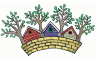
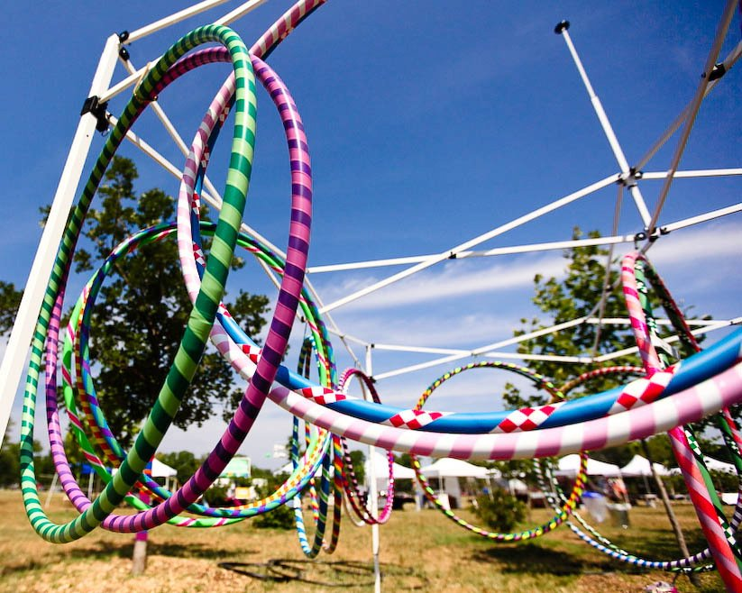

	

		

			<h1>Violet Crown Festival</h1>
			<h2>
				Saturday, May 3th, 2014  
				11AM to 6PM  
				<a href="https://plus.google.com/105953711653254975745/about?gl=us&amp;hl=en">Brentwood Park (map)</a>
			</h2>
		

		

	

### Details

Art, music and more on tap at this year’s festival!

There’s no better way to enjoy a spring Saturday than by spending it at the
Violet Crown Festival. Admission is free.

The festival will feature
[over 50 local arts and crafts vendors](#artists),
[family fun and children’s activities](#kids-activities),
[live music](#music),
[refreshments](#food-vendors), and a silent auction.

Parking by the festival is limited, so attendees are encouraged to walk or 
bike over if possible.  Brentwood Park is also near the Capital Metro
[#5](http://www.capmetro.org/schedulemap.aspx?f1=005&s=1&d=1) and
[#320](http://www.capmetro.org/schedulemap.aspx?f1=320&s=1&d=1)
bus lines if you're coming from further away.

### Food Vendors

* [Checko's Restaurant](http://www.gotchekos.com)
* [Craig O's Pizza](http://www.craigositalian.com)
* VCCW Domino Dogs (Hot Dogs and Sausage Wraps)
* [Amy's Ice Creams](http://www.amysicecreams.com)
* [Snowie Shaved Ice](http://www.austinshavedice.com)
* [Jack Hates Coffee](http://www.jackhatescoffee.com)

### Music

| 11am | [Jungle Jill and the Jaybirds](http://www.myspace.com/junglejilljaybirds) | entertainment for kids of all ages |
| noon | Roger Beck and the 29th Street Band | honored in 2005 by the [Texas Western Swing Hall of Fame](http://thewesternartists.com/twshof.htm) |
|  1pm | Lunch with Danny | soft rock/southern country |
|  2pm | Mooncharmer | McCallum High School's own hard rock/metal band |
|  3pm | [Rixon](http://www.rixonmusic.com/) | rock/pop/jazz |
|  4pm | [Jon Emery and the Red Hot Review](http://www.jonemery.com/) | hillbilly rock and roll |
|  5pm | [Deeanne René](http://www.deannrene.com/) | rock and roll |
{:.table}

### Artists

[ArtByLinds](http://artbylinds.etsy.com) | handmade cards, stationery, and paper goods
[Marta Pelrine-Bacon](http://www.martapelrinebacon.com) | stained glass
[Best Friends Forever Pet Portraits](http://bestfriendsforeverpetportraits.blogspot.com/) | pet portraits
[Hobo's Nickle](https://www.facebook.com/HobosNickel) | cigar box guitars
[Handmade Austin Women](http://handmadeaustinwomen.com) | handmade jewlery and accessories
[ArcheoModern](http://Archeomoderndesigns.com) | ancient inspirations, contemporary creations
[Phishstuff](http://phishstuff.etsy.com) | lampwork beads and jewlery
[Shannon Kors](http://sksurfgirl.etsy.com) | baby clothes
[jpear Design](http://jpeardesign.etsy.com) | ceramics
[Carol Bradley Designs](https://www.facebook.com/CarolBradleyDesigns) | hand-crafted casual jewelry with a rustic influence
[White Loft](http://shopwhiteloft.com) | handmade growth charts
[Sewn Joys](http://sewnjoys.etsy.com) | design dolls and unique gifts
Dark Star Jewelry | jewelry
[Sweet Sparrow Studio](http://facebook.com/sweetsparrowstudio) | handmade vintage inspired jewelry
[Left Hand Studios](http://lefthandart.com) | Drew Mounce's painting
[Stampin' Up - Kathleen Johnson](http://Kathleenstamps.stampinup.net) | handmade cards
[Elementals](http://gems23rd.blogspot.com) | artisan crafted gemstone and precious metal jewelry
Earth Art Austin | ceramics
David Fox | tie dye clothing
[Woman to Blame Tie Dyes](http://womantoblametiedyes.com) | tie dye clothing
[Merchant Ship Collective](http://Mscleather.com) | handmade leather goods
[Magpie's Trick](http://magpiestrick.com) | husband and wife collaboration of jewellery designers
[Masterpieces by Michiel](http://masterpiecesbymichiel.com) | jewelry and glasswork
[CarmenCanCreate](http://carmencancreate.com) | painting
[CDQ Art - Connie Adcock](http://cdqart.com) | painting
[Victrola Design](http://etsy.com/shop/victroladesign) | clothing
[Ruffled Clothing](http://facebook.com/ruffledclothing) | jewelry and clothing
[Sew Fun Bags](http://facebook.com/sewfunbags) | clothing and baby items
[Stones Throw Studio](http://stonesthrowstudio.com) | jewelry
[Elisa Alvarado](http://elisaalvarado.etsy.com) | paintings, crosses, assemblage and colorful unique art
[Wicked Whatnots](http://wickedwhatnots.com) | jewelry and gifts
[By Lillian](http://bylillian.com) | jewelry
Nancy Willis | clothing and wall art
[Violet Crown Soap Company](http://Violetcrownsoap.com) | hand-made soaps, lotions, and bath treats
[Petite Pensieri](http://petitepensieri.etsy.com) | baby clothes
[inviting](http://inviting.myshopify.com/) | letterpress cards
[Loggerhead Creations](https://www.facebook.com/LoggerheadCreations) | terrariums
Forrest Pettigrew | canned goods
[Monster Dance Designs](http://monsterdancedesigns.com) | sandblaster glasswear
Susan Prior | jewelry
Glen Corser | wooden costers, lamps
[Coral Reef Dreams](http://coralreefdreams.com) | ocean inspired jewelry
Lisa Rosenthal | hummingbird feeders & journals
[Saved Salvaged Sewn](http://facebook.com/savedsalvagedsewn) | refillable salvaged leather notebook covers
Lesley Woods | mosaic pots, stepping stones
[Third Coast Art Glass](http://thirdcoastartglass.blog.com) | art glass creations
[David Dettmer](http://utpress.utexas.edu/index.php/books/dettex) | Editor of _The Texas Book Two More Profiles, History, and Reminiscences of the University_
[Chaos Card Company](http://www.chaoscardcompany.com/) | printed clothing
[Flameless Shirt](http://flamelessshirt.com) | printed men's shirts
[Miz Tex Creations](http://facebook.com/MizTexCreations) | pet bandanas
[Mimosa Screen Printing ](http://mimosascreenprinting.com) | art prints
[Doug Naugle](http://dougnaugle.com) | acrylic paintings
[tEChLECTIC](http://techlectic.com) | clocks from upcycled computer hardware
[Medieval Moccasins](http://medievalmoccasins.com) | original handcrafted leather footwear
[Stoneworks Pottery](http://etsy.com/shop/stoneworkspottery) | handmade pots
[Zanny Adornments](http://facebook.com/zannyadornments.love) | jewelry
[Salvation Central](http://www.salvationcentral.com/) | stained glass & jewelry
{:.table}

### Kids Activities

* Fish Pond &mdash; [Faith Lutheran Church](http://www.faithlutheranaustin.org/)
* Spin Art &mdash; [Austin Creative ReUse](http://austincreativereuse.org/)
* Activity Table &mdash; [Stepping Stone School](http://www.steppingstoneschool.com/)
* Science/Activity/Craft Table &mdash; [Camp ¡Vámonos!](http://www.campvamonos.com/)
* Giant Chess &mdash; [Revive Church](http://revivechurchtx.com/)
* Face Painting &mdash; [Redeemer Lutheran Church](http://redeemer.net)
* Eye Testing Booth &mdash; [North Austin Lions Club](http://northaustinlionsclub.org/)
* Jugglers
* Hula Hoops
* Photobooth &mdash; [Ed's Photo Booth](http://www.edsphotobooth.com/)
* Lego Brick Activity Table &mdash; [Snapology](http://snapology.com)
* Stuffed Animal Petting Zoo &mdash; [The Stuffed Animal Rescue Foundation](http://thesarf.org/)

### Community Groups

* [Yard to Market Coop](http://yardtomarket.coop) Seed Swap
* [Brentwood Neighborhood Association](brentwoodaustin.blogspot.com)
* [Crestview Neighborhood Association](http://www.crestviewna.org/)
* [Friends of Brentwood Park](http://friendsofbrentwoodpark.org/)
* [Violet Crown Community Works](http://violetcrowncommunity.com/about/)

### Previous Years

Learn about our [2013 Violet Crown Festival](vcf_2013.html), including our many artists and musicians.
