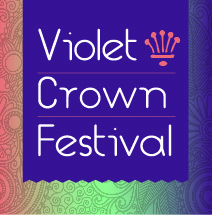

	

		

		

			<h1>Violet Crown Festival</h1>
			<h2>
				Saturday, May 4th, 2019  
				10AM to 5PM  
				<a href="https://goo.gl/maps/DuTPTEMibVL2">Brentwood Park (map)</a>
			</h2>
		

	

### Details

Art, music and more on tap at this year’s festival!

There’s no better way to enjoy a spring Saturday than by spending it at the
Violet Crown Festival. Admission is free.

To get up-to-date information, check the [Violet Crown Festival event page on Facebook](https://www.facebook.com/events/492192407976759/).
We are making frequent updates there with announcements of artists and activities.

If you would like to volunteer to help with the festival,
please see our <a href="https://www.givepulse.com/group/events/238305">sign-up page</a>.
We have needs in setup, teardown, and during the festival.

### Getting There

The festival is in Brentwood Park, just north of the swimming pool area. Some
parking is available in the neighborhood, but we encourage you to walk, bike,
or take Capitol Metro bus service.  Bus lines 3, 5, 320, and 803 are all within
a fifteen minute walk of the park.

### Music

| 11:30am | Special appearance by city council member Leslie Pool |
| noon | [Johnny Fury Band](https://www.johnnyfury.com/) |
|  1pm | [Dickie Lee Erwin](http://dickieleeerwin.com/) |
|  2pm | [Stone Wheels](https://www.facebook.com/Stone-Wheels-301271086611016/) |
|  3pm | [The Ron Titter Band](https://www.facebook.com/RonTitterBand/) |
{:.table .table-condensed}

### Food Vendors

* [Amy's Ice Creams](http://www.amysicecreams.com/)
* [Snowie Shaved Ice](http://austinshavediceco.com/)
* [Eldorado Cafe](http://www.eldoradocafeatx.com/)
* [Wanderlust Coffee](https://www.facebook.com/wanderlustcoffeetruck)
* [Roppolo's Pizza](https://roppolos.com/)
* Domino Dogs & Drinks & Coffee

### Artists

<ul><li><a href="{{ artist.url }}" target="_blank">{{ artist.name }}</a> - {{ artist.description }}</li></ul>

### Sponsoring

If you want to help sponsor the festival, please see our <a href="docs/VCF%202019%20sponsorship%20packet.pdf">2019 Sponsorship packet</a>.
