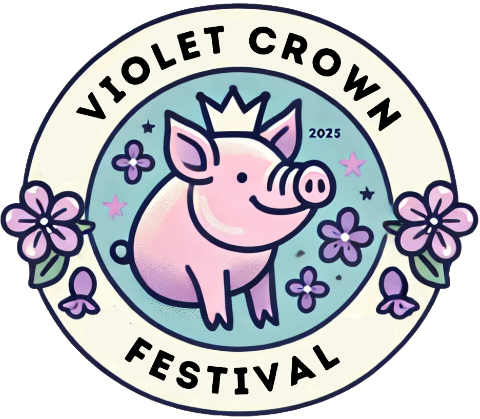

	

		

		

			<h1>Violet Crown Festival</h1>
			<h2>
				Saturday, May 3rd, 2025  
				10AM to 5PM  
				<a href="https://goo.gl/maps/DuTPTEMibVL2">Brentwood Park (map)</a>
			</h2>
		

	

### Details

Art, music and more on tap at this year's festival!

There's no better way to enjoy a spring Saturday than by spending it at the
Violet Crown Festival. Admission is free.

For 2025, we're also holding our first neighborhood BBQ challenge.
Teams from across Brentwood, Crestview, and the surrounding neighborhoods
will compete to make the most delicious BBQ, with tickets available for
the public to come sample their meats and vote on their favorite.

To get up-to-date information, check the [Violet Crown Festival event page on Facebook](https://www.facebook.com/events/1398286551134159).
We are making frequent updates there with announcements of artists and activities.

### Getting There

The festival is in Brentwood Park, just north of the swimming pool area. Some
parking is available in the neighborhood, but we encourage you to walk, bike,
or take Capitol Metro bus service.  Bus lines 3, 5, 320, and 803 are all within
a fifteen minute walk of the park.

### Volunteering

Sign up for a day-of-event volunteer slot [via this link](https://www.signupgenius.com/go/20F0A4AA5A829ABFA7-55767989-event#/).
Your help is greatly appreciated!

### Music

This year's music lineup is one of our strongest ever.

Headlining our event at 2pm is <a href="https://dalewatson.com/">Dale Watson and His Lone Stars</a>!

Dale Watson is an award-winning hardest working real country music musician and
producer who has been creating music and performing live for over 40 years. He
has shared the stage with such icons as Merle Haggard, Johnny Cash, Willie
Nelson, and Kris Kristofferson, just to name a few. He has been seen on David
Letterman, Jimmy Kimmel, and Austin City Limits, but most of the time, he is
touring the world, killing it for his fans, keeping the country music roots
sound alive. With over 30 albums and singles, Dale knows his way around the
recording studio, which is why he built Watsun Studio in Memphis, Tennessee,
complete with the 1937 board from Sun Studio.

Also performing for your enjoyment:

* 10 am [Caroline Paddock](https://www.instagram.com/carolineepaddock/)
* 11 am [Groundwork Music Project](https://www.groundworkmusic.org/)
* 12:30 pm [Jim Stringer Band](https://jimstringer.bandcamp.com/)
* 1:15 [Big Wy's Brass Band](https://www.bigwysbrassband.com/)
* 3:15 pm [Jimi Calhoun and Friends](https://www.jimicalhoun.com/)

### Food Vendors

In addition to the Violet Crown BBQ Showdown, we will have a variety of food trucks.  Details to be announced.

### Artists

We are currently open for <a href="vcf_apply">artist submissions</a>
to exhibit at the festival.

<!--
<ul><li><a href="{{ artist.url }}" target="_blank">{{ artist.name }}</a> - {{ artist.description }}</li></ul>
-->

### Sponsoring

If you're interesting in being a sponsor, please
<a href="vcf_sponsor">see our sponsorship form</a>.

Print deadlines are April 15th, so get your support for the fest in today.
