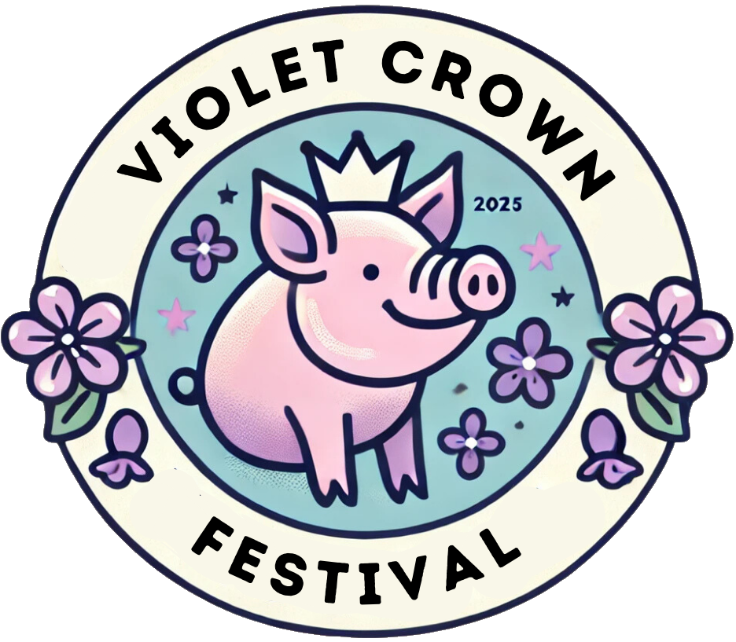

<--
layout: default
title: Violet Crown Festival (Spring 2026)
-->

	

		

		

			<h1>Violet Crown Festival</h1>
			<h2>
				Saturday, May 2nd, 2026  
				10AM to 5PM  
				<a href="https://goo.gl/maps/DuTPTEMibVL2">Brentwood Park (map)</a>
			</h2>
		

	

### Details

Art, music and more on tap at this year's festival!

There's no better way to enjoy a spring Saturday than by spending it at the
Violet Crown Festival. Admission is free.

To get up-to-date information, check the
[Violet Crown Community Works page on Facebook](https://www.facebook.com/VioletCrownCommunityWorks).
We are making frequent updates there with announcements of artists and activities.

### Getting There

The festival is in Brentwood Park, just north of the swimming pool area. Some
parking is available in the neighborhood, but we encourage you to walk, bike,
or take Capitol Metro bus service.  Bus lines 3, 5, 320, and 803 are all within
a fifteen minute walk of the park.

### Music

We're working on booking great bands and individual artists, but
don't yet have anything to announce.

### Food Vendors

We expect to again have a BBQ cookoff and a selection of other
food vendors, but nothing to announce just yet.

### Artists

We are currently accepting artist applications for the festival.
Visit <a href="vcf_apply">our submission form</a> to be considered
to be one of our vendors at the May event.

<!--
<ul><li><a href="{{ artist.url }}" target="_blank">{{ artist.name }}</a> - {{ artist.description }}</li></ul>
-->

### Sponsoring

If you're interesting in being a sponsor, please
<a href="vcf_sponsor">see our sponsorship form</a>.

Print deadlines are April 15th, so get your support for the fest in today.
