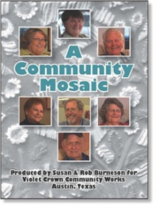

# "A Community Mosaic" (film) and Voices of the Violet Crown (community history project)

A Community Mosaic introduces viewers to Brentwood and Crestview, mid-century
neighborhoods that were among the first suburbs of Austin, Texas, and today
are part of Central Austin. Produced by Susan and Rob Burneson, the film
premiered at the dedication of the mosaic Wall of Welcome in March 2008.

In 2009, Susan and RA Community Mosaicob received the Mary Faye Barnes Award
for Excellence in Community History Projects from the Texas Oral History
Association. In 2010, A Community Mosaic was featured in the City of Austin’s
Faces of Austin multimedia program and the Lights, Camera, Austin film series
at the Windsor Park Branch Library.
[A shorter version is on the City of Austin YouTube page.](http://www.youtube.com/watch?v=IQCCWD5oiqA)

Since its premiere, the film has been screened for a number of community
groups and at several Violet Crown Festivals. The film can be checked out from
the Austin Public Library, and copies have been donated to neighborhood
schools (Brentwood Elementary School, Lamar Middle School, and McCallum High
School), Austin History Center, Baylor University Institute for Oral History,
and Hot Springs Documentary Film Institute Library.

The film is one element of
[Voices of the Violet Crown](http://violetcrownvoices.com), an ongoing
community history project coordinated by Susan and Rob. The project also
includes history displays at Violet Crown Festivals, the history booklet From
Abercrombie to the Violet Crown, oral history interviews, and feature articles
in the Crestview Neighborhood Association newsletter.

For more information about the project, visit the website at
[violetcrownvoices.com](http://violetcrownvoices.com). Contact Susan and Rob
Burneson, [nimbus@austin.rr.com](mailto:nimbus@austin.rr.com), 512-459-9613.
